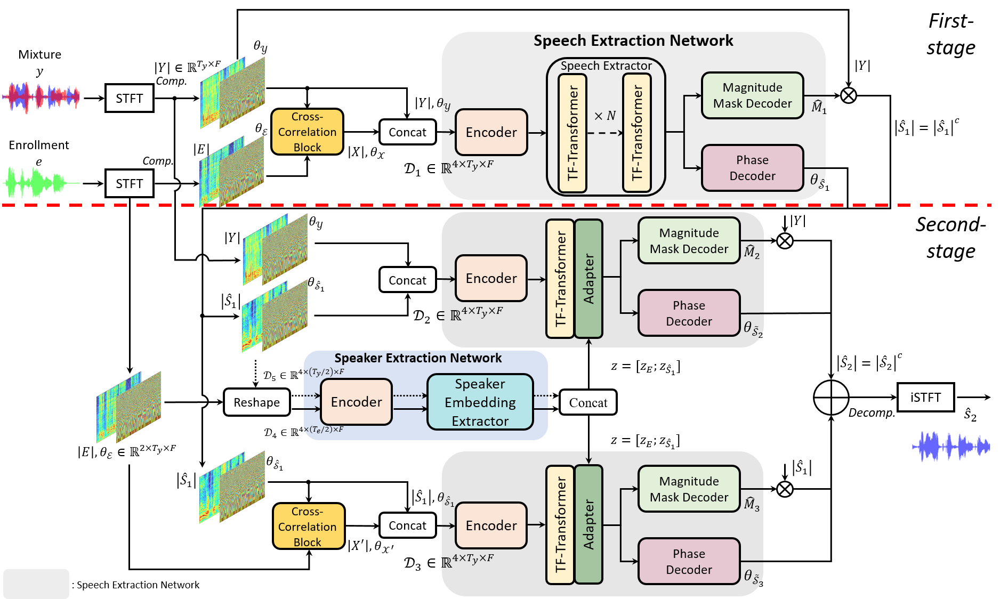
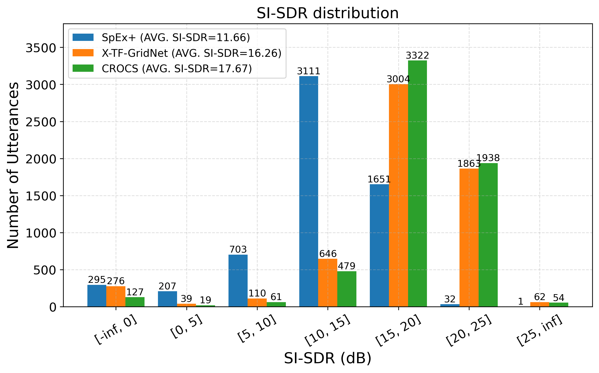

# CROCS-TSE

  

## 📄 Paper Status
This work will be submitted to IEEE Transactions on Audio, Speech, and Language Processing (TASLP) in 2026.

## 🔊 Overview
CROCS is a **two-stage target speaker extraction (TSE)** framework that exploits the cross-correlation for complex-spectra of the enrollment and mixture and dual post-refinements with low-dimensional speaker embeddings.

## ✨ Key Contributions
- More interpretable fusion based on the cross-correlation between the complex spectra of the enrollment and mixture, in a form analogous to the phase-sensitive mask (PSM)
- Two-stage-based dual post-refinements to further refine target speech
- Introduction of low-dimensional speaker embeddings via adpater moduels for speaker discriminability

## 📊 Experimental Results on Libri2Mix-clean dataset sampled at 8 kHz
<table>
  <tr>
    <td align="center">
      
    </td>
    <td align="center">
      
    </td>
  </tr>
</table>

## 🌈 Spectrogram Comparisons 

  

